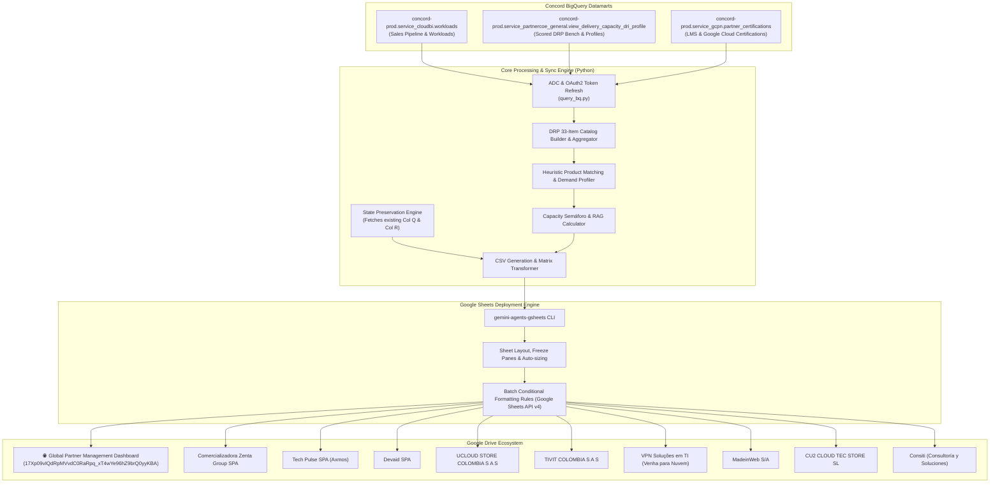

# Google Cloud Partner Action Trackers & Global Management Dashboard (`Decks_My_Partners`)

[](https://cloud.google.com)
[](https://www.python.org/downloads/)
[](https://github.com/oliverhartley/Decks_My_Partners)

Automated end-to-end data pipeline, heuristic intelligence engine, and synchronization workflow that powers **9 Partner Action Tracker Spreadsheets** and a centralized **Global Partner Management Dashboard** across LATAM and Iberia.

The workflow extracts commercial pipeline workloads, delivery capacity profiles, and practitioner certifications from Google's Concord BigQuery datamarts, applies automated capacity gap analysis and milestone risk alerts, and synchronizes live Google Sheets with full state preservation of manual user inputs.

---

## 📑 Table of Contents
1. [Executive Overview](#-executive-overview)
2. [End-to-End Architecture](#-end-to-end-architecture)
3. [Data Sources & BigQuery Datamarts](#-data-sources--bigquery-datamarts)
4. [Heuristic Intelligence & Analysis Engines](#-heuristic-intelligence--analysis-engines)
   - [Product-Level Workload to DRP Matching](#1-product-level-workload-to-drp-matching)
   - [Capacity Status (DRP Readiness Semáforo)](#2-capacity-status-drp-readiness-semáforo)
   - [Production Date Milestone Alert Rules](#3-production-date-milestone-alert-rules)
5. [Spreadsheet Architecture & Schemas](#-spreadsheet-architecture--schemas)
   - [Executive Summary (KPI Scorecard)](#1-executive-summary-global-master-only)
   - [Follow Up (Workloads Pipeline)](#2-follow_up--all_workloads_follow_up)
   - [DRP Status (Delivery Capacity)](#3-drp_status--all_drp_status)
   - [Accreditations & Certifications](#4-acreditaciones--all_acreditaciones)
6. [Partner Portfolio Directory](#-partner-portfolio-directory)
7. [Repository Structure](#-repository-structure)
8. [Setup, Authentication & Execution](#-setup-authentication--execution)
9. [Continuous Sync & GitHub Integration](#-continuous-sync--github-integration)

---

## 🎯 Executive Overview

Managing partner co-sell opportunities requires deep alignment between **sales demand** (committed/uncommitted pipeline deals in Vector CRM) and **partner technical capacity** (certified engineers and proven Delivery Readiness Platform competencies).

This automated system bridges that gap by:
- **Filtering Noise**: Isolating active 2025+ pipeline workloads specifically owned by target partners, focusing on high-velocity **Tier 2 (Corporate) & Tier 3 (SMB)** uncommitted deals.
- **Automating Technical Capacity Checks**: Performing granular product-level matching between deal architectural requirements (e.g., GKE, AlloyDB, Gemini Enterprise) and partner bench strength (Tier 1 & Tier 2 DRP profiles).
- **Risk Mitigation**: Surfacing real-time visual alerts for impending production target dates (overdue or within 14–45 days) for deals still in early or inflight stages (`0-2` and `3`).
- **Preserving Collaboration**: Maintaining bidirectional state so that manual touchpoints (`Last Touch`, `Link`) entered by Partner Development Managers (PDMs) and Partner Engineers (PSEs) in Google Sheets are never overwritten during automated refreshes.

---

## 🏗 End-to-End Architecture



---

## 📊 Data Sources & BigQuery Datamarts

The pipeline extracts verified enterprise data from Google Cloud Concord production tables:

| Domain | Table / View | Purpose & Extraction Logic |
| :--- | :--- | :--- |
| **Sales Workloads** | `concord-prod.service_cloudbi.workloads` | Active opportunities and workloads. Filtered for open 2025+ workloads where `partner_role = 'Principal' / 'Dedicated'` and customer segment is **Tier 2 (Corporate)** or **Tier 3 (SMB)**. Excludes Tier 1 direct accounts and government deals. |
| **Delivery Readiness** | `concord-prod.service_partnercoe_general.view_delivery_capacity_dri_profile` | Certified practitioner counts across Tier 1 (Senior/Architect) and Tier 2 (Practitioner) competencies mapped to the 7 parent pillars and solution plays. |
| **Certifications** | `concord-prod.service_gcpn.partner_certifications` | Individual active Google Cloud certifications (Cloud Architect, Data Engineer, Security Engineer, etc.) tied to partner candidate profiles. |
| **Expert Requests** | `concord-prod.service_vector_golden.vector_expert_requests` | Associated partner technical support and acceleration requests (Navigate / ER tickets). |

---

## 🧠 Heuristic Intelligence & Analysis Engines

### 1. Product-Level Workload to DRP Matching
Workloads in CRM often have loosely formatted architectural solutions. The matching engine constructs a normalized textual representation:
$$\text{Search Context} = \text{Pillar} \oplus \text{Sales Play} \oplus \text{Workload Solution} \oplus \bigcup \text{Key Products}$$

It evaluates against the 33-item canonical DRP catalog using priority heuristics:
- **Artificial Intelligence**: Differentiates between *Agentic Workplace Transformation* (`Gemini Enterprise`), *Customer Experience* (`Gemini Enterprise Agent Platform`), and *Model Customization / Vertex AI*.
- **Data & Analytics**: Matches specific sub-technologies (`BigQuery`, `Looker`, `Dataflow`, `Dataproc`).
- **Databases**: Routes to `AlloyDB for PostgreSQL`, `Cloud SQL`, or `Spanner`.
- **Modernization & Compute**: Identifies `Google Kubernetes Engine` (via "gke"/"kubernetes"), `Cloud Run`, and `Apigee`.
- **Infrastructure**: Resolves specialized engines (`Google Cloud VMware Engine`, `SAP on Google Cloud`, `Oracle`).
- **Security**: Maps to `Security Operations` (Chronicle/SecOps), `Google Threat Intelligence` (Mandiant), or `Security Command Center`.

### 2. Capacity Status (DRP Readiness Semáforo)
Positioned at **Column E** of every Follow-up sheet, this indicator assesses whether the partner has verified bench strength for the workload's specific architecture:
- 🔴 **Capacity Gap (0 DRP Profiles)**: Zero certified practitioners in the required product. High delivery risk.
- 🟡 **Constrained (1 DRP Profile)**: Exactly 1 certified practitioner. Bottleneck/single point of failure risk.
- 🟢 **Ready (X DRP Profiles)**: 2 or more certified practitioners available.

### 3. Production Date Milestone Alert Rules
Using Google Sheets API v4 batch requests, dynamic conditional formatting formulas evaluate the entire row based on the scheduled `Production Date` (Col O) for active inflight stages (`0-2` or `3`):
- 🔴 **Critical Alert** (`#EA4335` background, bold white text): Milestone is **$\le$ 14 days** away or past due.
- 🌸 **High Risk** (`#FCE8E6` background): Milestone is **15 to 30 days** away.
- 🟡 **Medium Risk** (`#FFF2CC` background): Milestone is **31 to 45 days** away.
- ⚪ **Normal / Completed**: Milestone is $>45$ days away or stage is $\ge 4$ (Live in Production).

---

## 📋 Spreadsheet Architecture & Schemas

### 1. Executive Summary (Global Master Only)
High-level operational scorecard aggregating partner performance:
- Partner Legal Name & Region
- Total Active Uncommitted Pipeline Workloads
- Total Pipeline Annual Recurring Revenue (ARR in USD)
- Total DRP Delivery Profiles Bench
- Total Google Cloud Certified Credentials
- Direct 1-Click Hyperlink to each partner's dedicated Action Tracker

### 2. `Follow_up` / `All_Workloads_Follow_up`
A comprehensive pipeline tracking table:
- In Individual Partner Trackers (`Follow_up` - 18 Columns):
  1. `Customer Account Name` *(Vector CRM Hyperlink)* [Col A]
  2. `Account Tier` *(Tier 2 Corporate or Tier 3 SMB)* [Col B]
  3. `Workload Name` *(Vector CRM Hyperlink)* [Col C]
  4. **`Workload Owner`** *(Plain text)* [Col D]
  5. **`Workload Progress`** *(Stage 0 through 5)* [Col E]
  6. **`Capacity Status (DRP Readiness)`** *(🔴/🟡/🟢 Semáforo)* [Col F]
  7. `Opportunity Name` *(Vector CRM Hyperlink)* [Col G]
  8. `Expert Requests` *(Direct link to Navigate / ER ticket)* [Col H]
  9. `Customer Sub Region` *(e.g., SOLA, NOLA, Brazil, Mexico)* [Col I]
  10. `Customer Micro Region` [Col J]
  11. `Primary Workload Pillar` [Col K]
  12. `Sales Play` [Col L]
  13. `Workload Solution` [Col M]
  14. `Begin Migration Date` [Col N]
  15. `Production Date` *(Triggers visual alert conditional formatting)* [Col O]
  16. `Annual Gross Revenue (ARR USD)` [Col P]
  17. **`Last Touch`** *(Manual user note — strictly preserved across refreshes)* [Col Q]
  18. **`Link`** *(Manual user URL — strictly preserved across refreshes)* [Col R]
- In Global Master Dashboard (`All_Workloads_Follow_up` - 19 Columns):
  - Prepends `Partner Name` [Col A], followed by the 18 columns above (Cols B to S, with Workload Owner at Col E and Workload Progress at Col F).

### 3. `DRP_Status` / `All_DRP_Status`
Complete 33-item capability matrix:
- `Pillar`, `Solution (Sales Play)`, `Product`
- `Tier 1 Profiles Count`, `Tier 2 Profiles Count`, `Total Tier 1 & 2 Profiles` *(Zero counts blanked for visual clarity)*
- `Capacity Status (DRP vs Workloads)` *(RAG matched against active uncommitted demand)*

### 4. `Acreditaciones` / `All_Acreditaciones`
Individual practitioner accreditation ledger:
- `Certification / Accreditation Name`, `Type`, `Level / Sub Type`
- `Candidate Name`, `Candidate Email`
- `Issued Date`, `Expiration Date`, `Partner Legal Entity`

---

## 🏢 Partner Portfolio Directory

All action trackers and the global master are centralized in Google Drive Folder: [`1lYosvTFvXxhSAOzH7NQyJMgdXS-Gsz1t`](https://drive.google.com/drive/folders/1lYosvTFvXxhSAOzH7NQyJMgdXS-Gsz1t).

| Partner Name | Region / Country | SFDC Partner ID | DRP Key | Google Sheet Action Tracker |
| :--- | :--- | :--- | :--- | :--- |
| 🌐 **Global Partner Management Dashboard** | **LATAM / Iberia** | *Master Rollup* | *Master Rollup* | [`17Xp09vIQdRpMVvdC0RaRpq_xT4wYe96hZ9brQ0yyKBA`](https://docs.google.com/spreadsheets/d/17Xp09vIQdRpMVvdC0RaRpq_xT4wYe96hZ9brQ0yyKBA/edit) |
| **Comercializadora Zenta Group SPA** | Chile | `0014M00001h39BLQAY` | `P20220602109` | [`1xG-27ye3Wk4ob9nr3N08KP2a1ufaPRCxAP4o93NKj1Q`](https://docs.google.com/spreadsheets/d/1xG-27ye3Wk4ob9nr3N08KP2a1ufaPRCxAP4o93NKj1Q/edit) |
| **Tech Pulse SPA (Axmos)** | Chile | `0014M00002JmizDQAR` | `P20260318001` | [`1qWdLgRDmHG9wMGjiOZ1fJvj4AmHbfKwrBPpuV8r2uwI`](https://docs.google.com/spreadsheets/d/1qWdLgRDmHG9wMGjiOZ1fJvj4AmHbfKwrBPpuV8r2uwI/edit) |
| **Devaid SPA** | Chile | `0014M00001h38aiQAA` | `P20220923084` | [`1UqYI0iTbxFL1f8ohC3e-uMQCD2we_8Ne3ODmDjnT8U8`](https://docs.google.com/spreadsheets/d/1UqYI0iTbxFL1f8ohC3e-uMQCD2we_8Ne3ODmDjnT8U8/edit) |
| **UCLOUD STORE COLOMBIA S A S** | Colombia | `0014M00002M7lcJQAR` | `0014M00002M7lcJQAR` | [`1yOtNpVu8O8QQFeRx96s8TmgUtKcXAHYBdsoiZSmnSOI`](https://docs.google.com/spreadsheets/d/1yOtNpVu8O8QQFeRx96s8TmgUtKcXAHYBdsoiZSmnSOI/edit) |
| **TIVIT COLOMBIA S A S** | Colombia / Multi | `0014M00001kxZPMQA2` | `P20220923297` | [`1nUwpOaqhvpBmVoEb7i_M3C18jhmrJ7bQ1mrfwyXo02o`](https://docs.google.com/spreadsheets/d/1nUwpOaqhvpBmVoEb7i_M3C18jhmrJ7bQ1mrfwyXo02o/edit) |
| **VPN Soluções em TI (Venha para Nuvem)** | Brazil | `0014M00001uFlbSQAS` | `P20220602104` | [`1zcIQXnDbrR_WRhciVOD0XCN8RXK0_gHT0MUSExcqBbo`](https://docs.google.com/spreadsheets/d/1zcIQXnDbrR_WRhciVOD0XCN8RXK0_gHT0MUSExcqBbo/edit) |
| **MadeinWeb S/A** | Brazil | `0014M00002GGNRCQA5` | `P20231208017` | [`1K2_rFQ5tFMvvk_DnRNxbg3iJ9ZP-MkXtrrcuo04qTOI`](https://docs.google.com/spreadsheets/d/1K2_rFQ5tFMvvk_DnRNxbg3iJ9ZP-MkXtrrcuo04qTOI/edit) |
| **CU2 CLOUD TEC STORE SL** | Spain / LATAM | `0014M00001h35nAQAQ` | `P20220923048` | [`1oPv0eexAbvaP_sGQx70X8gEiooR9dXCFuFv1QDFhUew`](https://docs.google.com/spreadsheets/d/1oPv0eexAbvaP_sGQx70X8gEiooR9dXCFuFv1QDFhUew/edit) |
| **Consiti (Consultoría y Soluciones)** | Central America | `001Kf000013fuVXIAY` | `001Kf000013fuVXIAY` | [`1jsiE3qCJxv5EnxnKJzBdoNFOENc1HA8TdlEXGgnUelo`](https://docs.google.com/spreadsheets/d/1jsiE3qCJxv5EnxnKJzBdoNFOENc1HA8TdlEXGgnUelo/edit) |

---

## 📁 Repository Structure

```
.
├── README.md                                         # Comprehensive architecture & operational documentation
├── query_bq.py                                       # Headless OAuth2 / ADC BigQuery execution helper
├── update_all_partner_decks.py                       # Master pipeline: queries BQ, computes RAG, updates all 10 sheets
├── populate_global_management_dashboard.py           # Standalone aggregator for Global Master Dashboard
├── sync_partner_followup_sheets.py                   # Dedicated sync module for Follow-up sheets with state preservation
├── apply_production_date_alerts.py                   # Conditional formatting applicator for milestone risk alerts
├── build_drp_and_accreditations_tabs.py              # DRP & Accreditations sheet builder
├── created_trackers.json                             # Canonical metadata registry of partner IDs, names & spreadsheet IDs
├── global_dashboard_data/                            # Snapshots of master CSVs (Follow-up, DRP, Accreditations, KPIs)
├── followup_data_latest/                             # Snapshots of latest partner Follow-up CSVs
├── drp_data_latest/                                  # Snapshots of latest partner DRP capacity CSVs
├── accred_data_latest/                               # Snapshots of latest partner Accreditations CSVs
└── test_*.py                                         # Diagnostic, inspection, and verification test suite
```

---

## 🚀 Setup, Authentication & Execution

### 1. Prerequisites
- Python 3.10+
- Google Cloud SDK (`gcloud`) authenticated with access to `concord-prod` BigQuery.
- `gemini-agents-gsheets` CLI installed at `/google/bin/releases/gemini-agents-gsheets/gsheets`.

### 2. Google Cloud Authentication
Ensure Application Default Credentials (ADC) are refreshed:
```bash
gcloud auth application-default login
```

### 3. Run Full Pipeline Synchronization
To refresh all 10 spreadsheets (recalculating DRP RAG, pulling new workloads, formatting alert rules, and preserving manual notes):
```bash
python3 update_all_partner_decks.py
```

---

## 🔄 Continuous Sync & GitHub Integration

This repository is maintained and synchronized with GitHub:
👉 **[https://github.com/oliverhartley/Decks_My_Partners](https://github.com/oliverhartley/Decks_My_Partners)**

To pull latest updates or push new operational enhancements:
```bash
git add .
git commit -m "Update workflow architecture, heuristic logic, and documentation"
git push -u origin main
```
