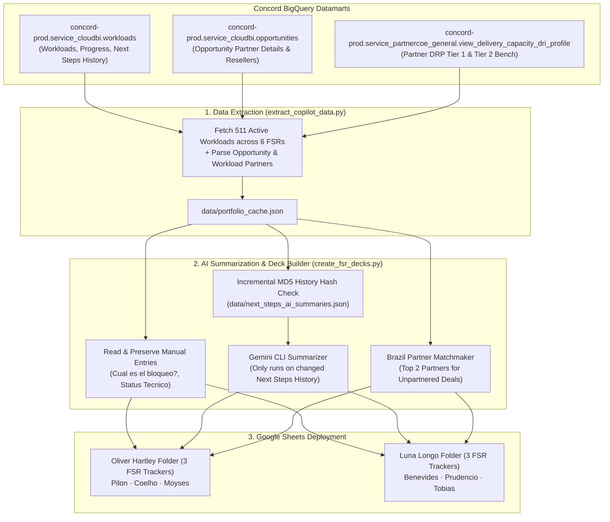

# Brazil FSR Action Trackers & Partner Management Ecosystem (`Decks_My_Partners`)

[](https://cloud.google.com)
[](https://www.python.org/downloads/)
[](https://github.com/oliverhartley/Decks_My_Partners)

Automated end-to-end data pipeline, AI summarization engine, partner matchmaker, and synchronization workflow that powers:
1. **6 Brazil FSR Action Tracker Spreadsheets** (for **Oliver Hartley** and **Luna Longo**, aligned with Customer Engineers **Diego Baldini** and **Victor Hugo Ferreira**).
2. **Partner Action Tracker Spreadsheets, PE Dashboards & Global Partner Management Dashboard** across LATAM and Iberia.

---

## 📑 Table of Contents
1. [Brazil FSR Action Trackers](#-brazil-fsr-action-trackers)
   - [FSR Portfolio Directory](#1-fsr-portfolio-directory)
   - [End-to-End FSR Sync Architecture](#2-end-to-end-fsr-sync-architecture)
   - [Spreadsheet Tabs & 16-Column `Follow_up` Schema](#3-spreadsheet-tabs--16-column-follow_up-schema)
   - [AI Summary Next Steps & Incremental Hash Cache](#4-ai-summary-next-steps--incremental-hash-cache)
   - [Opportunity Partner vs. Workload Partner Resolution](#5-opportunity-partner-vs-workload-partner-resolution)
   - [CLI Execution & 2:00 AM Daily Automation](#6-cli-execution--200-am-daily-automation)
2. [Partner Action Trackers & Global Management Dashboard](#-partner-action-trackers--global-management-dashboard)
3. [Data Sources & BigQuery Datamarts](#-data-sources--bigquery-datamarts)
4. [Repository Structure](#-repository-structure)

---

## 🇧🇷 Brazil FSR Action Trackers

### 1. FSR Portfolio Directory

#### Oliver Hartley's FSR Trackers
- **Google Drive Folder**: [`1WG2zMHJXRU8HnSCVR2cTN_5KeAUm5kQ3`](https://drive.google.com/drive/folders/1WG2zMHJXRU8HnSCVR2cTN_5KeAUm5kQ3)
- **Supporting Customer Engineer (CE)**: **Diego Baldini** (`diegobaldini@google.com`)

| FSR Name | Email | Workloads (Partnered / Unpartnered) | Active Pipeline ARR | Google Sheets Action Tracker |
| :--- | :--- | :---: | :---: | :--- |
| **Felipe Pilon** | `fpilon@google.com` | 91 (41 / 50) | \$19,508,964.93 | [`1gS9JWRb-aReMKOiJzhlKEu0TFTb4fF8fNROcTKWf7jU`](https://docs.google.com/spreadsheets/d/1gS9JWRb-aReMKOiJzhlKEu0TFTb4fF8fNROcTKWf7jU/edit) |
| **Roberta Coelho** | `robertacoelho@google.com` | 44 (41 / 3) | \$5,170,842.32 | [`1wBiY2bqGo-NJaVeET6g8GRKfOTMDkQaSUhbD5xPfb5M`](https://docs.google.com/spreadsheets/d/1wBiY2bqGo-NJaVeET6g8GRKfOTMDkQaSUhbD5xPfb5M/edit) |
| **Vanessa Moyses** | `vmmoyses@google.com` | 150 (119 / 31) | \$12,991,536.00 | [`1UXbDWQNf1_wvm6_WHtKX2QIWXzRgib_xMpMGfnu5nKg`](https://docs.google.com/spreadsheets/d/1UXbDWQNf1_wvm6_WHtKX2QIWXzRgib_xMpMGfnu5nKg/edit) |

#### Luna Longo's FSR Trackers
- **Google Drive Folder**: [`1KkI9RuO6Qxoi03MmMJ48jlTMeAmkNNrZ`](https://drive.google.com/drive/folders/1KkI9RuO6Qxoi03MmMJ48jlTMeAmkNNrZ)
- **Supporting Customer Engineer (CE)**: **Victor Hugo Ferreira** (`vhferreira@google.com`)

| FSR Name | Email | Workloads (Partnered / Unpartnered) | Active Pipeline ARR | Google Sheets Action Tracker |
| :--- | :--- | :---: | :---: | :--- |
| **Daniela Benevides** | `dbenevides@google.com` | 93 (77 / 16) | \$7,770,869.00 | [`1PlnciU1NuNuo7SL0Jxb-X3HWksLzRXpYOVFk8UqmdAI`](https://docs.google.com/spreadsheets/d/1PlnciU1NuNuo7SL0Jxb-X3HWksLzRXpYOVFk8UqmdAI/edit) |
| **Daniel Prudencio** | `dprudencio@google.com` | 77 (52 / 25) | \$12,732,115.14 | [`1qOUzmqu0vrZ7a19oSDR8KZTuDAfbdkJLiCDMoql9iqM`](https://docs.google.com/spreadsheets/d/1qOUzmqu0vrZ7a19oSDR8KZTuDAfbdkJLiCDMoql9iqM/edit) |
| **Sarah Tobias** | `tobiassarah@google.com` | 56 (41 / 15) | \$13,730,334.92 | [`1eB2g5osFTKxH0i9B7AoddQO-MJ_qnewu3nwIozquTIs`](https://docs.google.com/spreadsheets/d/1eB2g5osFTKxH0i9B7AoddQO-MJ_qnewu3nwIozquTIs/edit) |

---

### 2. End-to-End FSR Sync Architecture


```mermaid
flowchart TD
    subgraph BigQuery ["Concord BigQuery Datamarts"]
        BQ_W["concord-prod.service_cloudbi.workloads<br/>(Workloads, Progress, Next Steps History)"]
        BQ_O["concord-prod.service_cloudbi.opportunities<br/>(Opportunity Partner Details & Resellers)"]
        BQ_DRP["concord-prod.service_partnercoe_general.view_delivery_capacity_dri_profile<br/>(Partner DRP Tier 1 & Tier 2 Bench)"]
    end

    subgraph Ingestion ["1. Data Extraction (extract_copilot_data.py)"]
        INGEST["Fetch 511 Active Workloads across 6 FSRs<br/>+ Parse Opportunity & Workload Partners"]
        CACHE["data/portfolio_cache.json"]
    end

    subgraph AI_And_Build ["2. AI Summarization & Deck Builder (create_fsr_decks.py)"]
        MANUAL["Read & Preserve Manual Entries<br/>(Cual es el bloqueo?, Status Tecnico)"]
        AICACHE["Incremental MD5 History Hash Check<br/>(data/next_steps_ai_summaries.json)"]
        GEMINI["Gemini CLI Summarizer<br/>(Only runs on changed Next Steps History)"]
        MATCH["Brazil Partner Matchmaker<br/>(Top 2 Partners for Unpartnered Deals)"]
    end

    subgraph Sheets ["3. Google Sheets Deployment"]
        OLIVER_SHEETS["Oliver Hartley Folder (3 FSR Trackers)<br/>Pilon · Coelho · Moyses"]
        LUNA_SHEETS["Luna Longo Folder (3 FSR Trackers)<br/>Benevides · Prudencio · Tobias"]
    end

    BQ_W --> INGEST
    BQ_O --> INGEST
    BQ_DRP --> INGEST
    INGEST --> CACHE
    CACHE --> MANUAL
    CACHE --> AICACHE
    AICACHE --> GEMINI
    CACHE --> MATCH
    MANUAL --> OLIVER_SHEETS
    GEMINI --> OLIVER_SHEETS
    MATCH --> OLIVER_SHEETS
    MANUAL --> LUNA_SHEETS
    GEMINI --> LUNA_SHEETS
    MATCH --> LUNA_SHEETS
```

---

### 3. Spreadsheet Tabs & 19-Column `Follow_up` Schema

Each FSR Action Tracker spreadsheet contains 3 tabs:

#### Tab 1: `Follow_up` (19 Columns, Data Starts on Row 6)
- **Row 1**: FSR metadata header (`FSR: <Name> (<Email>)`, `Supporting CE: <CE>`, `Last Update: <Date>`).
- **Rows 2–4**: Unmerged, clean empty rows without formatting.
- **Row 5**: Frozen table header (`#1A73E8` Google Blue background, bold white text).
- **Rows 6+**: Sorted by ARR descending, plain uncolored data cells (no conditional formatting rules, no zebra striping, no borders), text wrapping set to `CLIP`, and active Vector hyperlinks enabled via `copyPaste` activation.

| Col | Index | Header Name | Source / Behavior |
| :---: | :---: | :--- | :--- |
| **A** | `0` | `Customer Account Name` | Vector Account hyperlink (`Account/<sfdc_account_id>/view`) |
| **B** | `1` | `Opportunity Name` | Vector Opportunity hyperlink (`Opportunity/<opportunity_id>/view`) |
| **C** | `2` | `Workload Name` | Vector Workload hyperlink (`Workload__c/<workload_id>/view`) |
| **D** | `3` | `Annual Gross Revenue (ARR USD)` | `w.metrics.annual_gross_revenue` formatted as `$#,##0.00` |
| **E** | `4` | `Workload Progress` | Numeric stage prefix only (`0-2`, `3`, `4.1`, `4.2`, `4.3`), formatted as `TEXT` |
| **F** | `5` | `Implementation Date` | `w.workload_details.begin_migration_date` (`YYYY-MM-DD`) |
| **G** | `6` | `Days Until Implementation` | Dynamic formula `=IF(F6<>"", F6-TODAY(), "")` |
| **H** | `7` | `Production Date` | `w.workload_details.production_date` (`YYYY-MM-DD`) |
| **I** | `8` | `Days Until Production` | Dynamic formula `=IF(H6<>"", H6-TODAY(), "")` |
| **J** | `9` | `Cual es el bloqueo?` | **Manual dropdown (`Comercial`, `Tecnico`)** — preserved across syncs |
| **K** | `10` | `Status Tecnico` | **Manual free-text field** — preserved across syncs |
| **L** | `11` | `AI Summary Next Steps` | 1-sentence executive AI summary of `w.field_history.next_steps_field_history` |
| **M** | `12` | `Opportunity Partner` | Active partner attached to the Opportunity in Vector (`o.partner_details`), hyperlinked |
| **N** | `13` | `Workload Partner` | Partner attached to the Workload in Vector (`w.workload_details.partner_name`), hyperlinked |
| **O** | `14` | `Workload Owner Email` | `<owner_user_name>@google.com` |
| **P** | `15` | `Primary CE Technical Owner Email` | `<technical_owner_user_name>@google.com` |
| **Q** | `16` | `Partner Technical Owner Email` | Auto-resolved from BigQuery (`psf_fund_request`, `gcpn_registration`, `technical_deployment_lead_details`) + manual override preserved across syncs |
| **R** | `17` | `Technical win` | **Interactive Checkbox (`BOOLEAN`)** — preserved across syncs |
| **S** | `18` | `Propousal sent to client` | **Interactive Checkbox (`BOOLEAN`)** — preserved across syncs |

#### Tab 2: `Executive_Summary`
- **Section 1**: Portfolio Vital Metrics (Total ARR, Total Workloads, Partnered vs. Unpartnered share, High Risk & Critical Path deals, Dedicated Supporting CE).
- **Section 2**: Pipeline by Commercial Progress Stage (`00-01`, `02`, `03`, `04+`).
- **Section 3**: Partner Engagement & Delivery Concentration (Active partners ranked by ARR + unpartnered volume).
- **Section 4**: Top 10 Strategic Workloads ranked by ARR.

#### Tab 3: `Unpartnered_Matchmaker`
- Lists all unpartnered workloads for the FSR and recommends the **Top 2 Candidate Brazil Partners** ranked by certified DRP Tier 1 / Tier 2 bench, Partner Advantage tier level, and recent Vector support case health, complete with transparent selection logic.

---

### 4. AI Summary Next Steps & Incremental Hash Cache

To keep daily refreshes fast while providing rich context from `w.field_history.next_steps_field_history` and `w.workload_details.next_steps`:
- `create_fsr_decks.py` computes an MD5 hash of each workload's `(next_steps_history, next_steps)` payload and checks `data/next_steps_ai_summaries.json`.
- **Unchanged workloads (`0 ms`)**: If the hash matches the cached entry, the existing Portuguese executive summary is reused immediately without calling the model.
- **New or updated workloads**: Only workloads whose `Next Steps History` changed in Vector since the last run invoke `/google/bin/releases/gemini-agents-generate/generate text` to synthesize a new 1-sentence summary (prefixed with the latest `DD/MM` update date) and update `data/next_steps_ai_summaries.json`.

---

### 5. Opportunity Partner vs. Workload Partner Resolution

Many deals in Vector have a partner attached at the **Opportunity** level before (or instead of) being attached to the **Workload**:
- **`Opportunity Partner` (Col M)**: Extracted in `extract_copilot_data.py` from `concord-prod.service_cloudbi.opportunities` (`o.partner_details.details` and `o.quote_details.quote_reseller_partner_name`). Filters for `status = 'Active'`, prefers service/reseller partners over pure ISVs (e.g., Intel), and ranks by workload partner match, quote reseller match, attribution %, `Major` role, and reseller flag.
- **`Workload Partner` (Col N)**: Extracted from `concord-prod.service_cloudbi.workloads` (`w.workload_details.partner_id` and `w.workload_details.partner_name`).

---

### 6. CLI Execution & 2:00 AM Daily Automation

#### Manual Execution
```bash
# 1. Refresh BigQuery cache for all 6 FSRs (511 workloads)
python3 extract_copilot_data.py

# 2. Update all 6 FSR Action Tracker spreadsheets
python3 create_fsr_decks.py

# Or update a single FSR spreadsheet only (e.g. Roberta Coelho)
python3 create_fsr_decks.py --fsr robertacoelho
```

#### Automated Daily Schedule (`Brazil FSR Decks Daily Sync`)
- **Sidecar Configuration**: `~/.gemini/config/sidecars/fsr-decks-sync/sidecar.json`
- **Schedule**: `CRON_TZ=America/Santiago 0 2 * * 1-5` (**Every working day Monday–Friday at 2:00 AM Chile Time**).
- **Workflow**: Automatically runs `python3 extract_copilot_data.py` followed by `python3 create_fsr_decks.py`, preserving manual entries in `fsr_manual_entries.json` and updating all 6 FSR spreadsheets.

---

## 🏢 Partner Action Trackers & Global Management Dashboard

In addition to the 6 Brazil FSR Action Trackers, this repository powers the **Partner Action Trackers**, **PE Dashboards**, and **Global Partner Management Dashboard**:
- **Root Google Drive Folder**: [`1lYosvTFvXxhSAOzH7NQyJMgdXS-Gsz1t`](https://drive.google.com/drive/folders/1lYosvTFvXxhSAOzH7NQyJMgdXS-Gsz1t)
- **Master Sync Scripts**:
  - `python3 update_all_partner_decks.py`: Updates partner action trackers, DRP capacity RAG statuses, accreditations, and `Growth` tabs.
  - `python3 run_parallel_sync.py`: Parallelized multi-PE sync orchestrator (`CRON_TZ=America/Santiago 0 2 * * 1-5` via `~/.gemini/config/sidecars/partner-decks-sync/sidecar.json`).

---

## 📊 Data Sources & BigQuery Datamarts

| Domain | BigQuery Table / View | Purpose |
| :--- | :--- | :--- |
| **Workloads & History** | `concord-prod.service_cloudbi.workloads` | Active workloads, ARR, implementation/production dates, owners, CEs, workload partners, and `field_history.next_steps_field_history`. |
| **Opportunities & Partners** | `concord-prod.service_cloudbi.opportunities` | Opportunity names, stages, active Opportunity Partners (`partner_details.details`), and quote resellers. |
| **DRP Delivery Capacity** | `concord-prod.service_partnercoe_general.view_delivery_capacity_dri_profile` | Partner Tier 1 and Tier 2 practitioner counts across pillars, solutions, and products. |
| **Partner Certifications** | `concord-prod.service_cloudbi.partner_certifications` | Active Google Cloud certifications per partner practitioner. |
| **Vector Support Cases** | `concord-prod.service_customerexperience_support.case_detail` | Customer and partner support cases (last 6 months) for risk scoring. |

---

## 📁 Repository Structure

```text
.
├── README.md                                  # Operational guide & spreadsheet directory
├── ARCHITECTURE.md                            # Deep-dive system architecture & data pipeline specification
├── query_bq.py                                # OAuth2 / Stubby / ADC BigQuery execution helper
├── extract_copilot_data.py                    # Ingests workloads, Opportunity/Workload partners & DRP bench for all 6 Brazil FSRs
├── create_fsr_decks.py                        # Builds & formats all 6 Brazil FSR Action Trackers (16-col Follow_up, Summary, Matchmaker)
├── copilot_engine.py                          # Partner matchmaker & workload bottleneck diagnostics engine
├── fsr_trackers.json                          # Registry of the 6 Brazil FSR Action Tracker spreadsheet IDs & metrics
├── fsr_manual_entries.json                    # Persistent cache of manual FSR tracker inputs (Cual es el bloqueo?, Status Tecnico, etc.)
├── data/
│   ├── portfolio_cache.json                   # Extracted cache of 511 FSR workloads & 20 Brazil candidate partners
│   └── next_steps_ai_summaries.json           # MD5 hash-keyed cache of AI Next Steps History summaries
├── fsr_decks_data/                            # Generated CSV snapshots for the 6 FSR trackers
├── update_all_partner_decks.py                # Partner-centric Action Tracker & Global Dashboard pipeline
└── run_parallel_sync.py                       # Parallel sync runner for Partner Action Trackers
```
